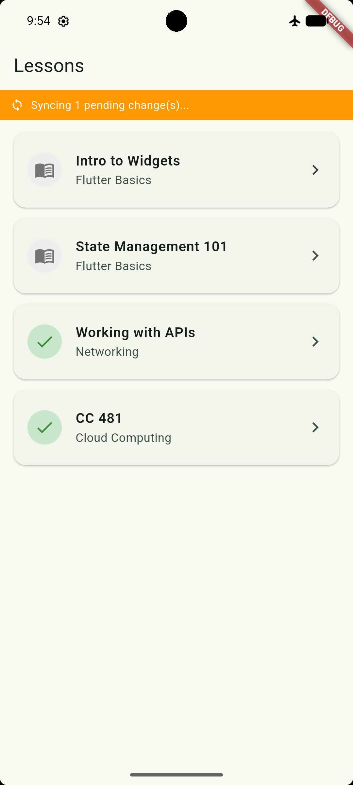
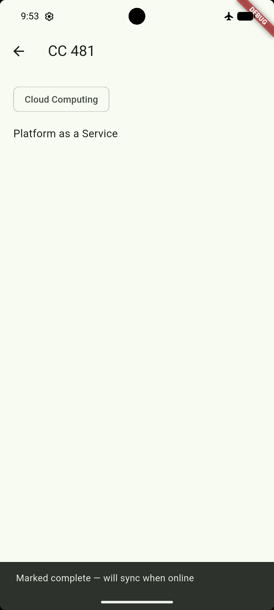
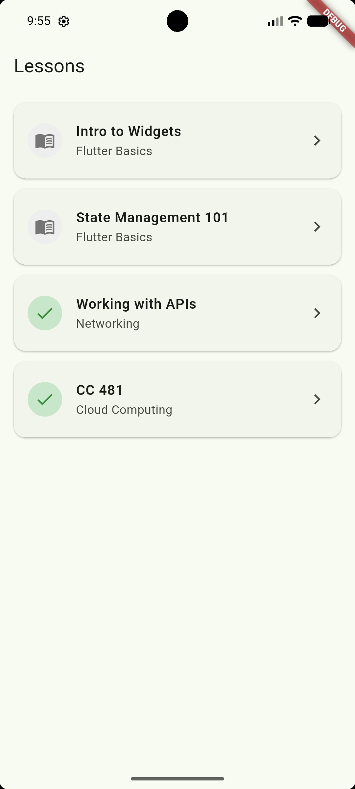

# Offline Lessons

A Flutter-based learning app designed for reliable offline study and smart sync behavior. Users can browse lessons even without internet access, mark them complete locally, and have their progress automatically synced with Supabase when connectivity returns.

## Overview

Offline Lessons is built for situations where internet access is unreliable or unavailable. The app stores lesson content locally and tracks user progress in a queue, ensuring that learning continues without interruption while preserving data consistency once the device reconnects.

## Key Features

- Offline access to lesson content
- Local-first completion tracking
- Automatic sync with Supabase when the device reconnects
- Network-aware behavior using connectivity detection
- SQLite-based local cache for fast, resilient reads
- Last-write-wins conflict handling for completion updates

## Screenshots

### 1. Offline / Pending State

<p align="center">
  
</p>

The app remains fully usable even when internet connectivity is weak or unavailable, and the pending sync state remains transparent to the user.

### 2. Lesson Completion While Offline

<p align="center">
  
</p>

Users can complete lessons without an active connection, and the activity is saved locally until synchronization is possible.

### 3. Sync After Reconnect

<p align="center">
  
</p>

Once the connection is restored, the queued completion is synced back to the remote Supabase database without interrupting the user experience.

---

## Tech Stack

- Flutter / Dart
- Supabase for authentication and remote data storage
- SQLite via sqflite for local caching and queued updates
- connectivity_plus for network status monitoring

## Architecture

```text
lib/
  config/                 Supabase credentials and configuration
  models/                 Lesson and Completion models
  services/
    local_db_service.dart     SQLite cache and queue management
    supabase_service.dart     Remote data access
    sync_service.dart         Sync orchestration and conflict logic
    connectivity_service.dart  Network state handling
  screens/                Login, lesson list, and lesson detail views
  widgets/                Reusable UI components
```

### Data Flow

- Read path: the app reads from the local SQLite cache first, so content remains available offline.
- Write path: lesson completion updates are written locally first and then synced to Supabase when online.
- Sync behavior: connectivity-aware background sync keeps data consistent without blocking the user experience.

## Supabase Setup

Create the required tables in the Supabase SQL editor:

```sql
create table lessons (
  id uuid primary key default gen_random_uuid(),
  title text not null,
  content text not null,
  module text,
  order_index int default 0,
  updated_at timestamptz default now()
);

create table completions (
  id uuid primary key default gen_random_uuid(),
  user_id uuid not null references auth.users(id),
  lesson_id uuid not null references lessons(id),
  completed_at timestamptz not null,
  synced_at timestamptz default now(),
  client_updated_at timestamptz not null,
  unique(user_id, lesson_id)
);
```

Enable row-level security and policies:

```sql
alter table lessons enable row level security;
alter table completions enable row level security;

create policy "lessons_read" on lessons
  for select using (auth.role() = 'authenticated');

create policy "completions_own_read" on completions
  for select using (auth.uid() = user_id);

create policy "completions_own_write" on completions
  for insert with check (auth.uid() = user_id);

create policy "completions_own_update" on completions
  for update using (auth.uid() = user_id);
```

Enable Email authentication in the Supabase dashboard and create at least one test user. Then add sample lesson data in the `lessons` table.

## App Configuration

Update your Supabase URL and anon key in `lib/config/supabase_config.dart`:

```dart
class SupabaseConfig {
  static const String url = 'YOUR_SUPABASE_URL';
  static const String anonKey = 'YOUR_SUPABASE_ANON_KEY';
}
```

## Getting Started

### Prerequisites

- Flutter SDK installed and working correctly (`flutter doctor`)
- A Supabase project
- Android Studio or a physical device for testing

### Run the App

```bash
flutter pub get
flutter run
```

## Conflict Resolution

The sync behavior is documented in [SYNC_DESIGN.md](./SYNC_DESIGN.md). In short, updates use a last-write-wins strategy based on the `client_updated_at` timestamp.

## Known Limitations

- Sync is triggered on reconnect and foreground events rather than true background execution while the app is fully closed.
- Only text-based lesson content is cached for offline access.
- The conflict-handling logic currently focuses on completion records.
- The app was primarily validated on Android emulator workflows.

## Demo Video

Watch the app walkthrough and feature demo here:

[▶️ Offline Lessons Demo Video](https://drive.google.com/file/d/1SnxHUWQjhjDp7yWgK-ZKYzNeSmvlWzK4/view?usp=drive_link)

This video demonstrates the offline learning flow, pending sync behavior, and the app’s reconnect-based synchronization workflow.